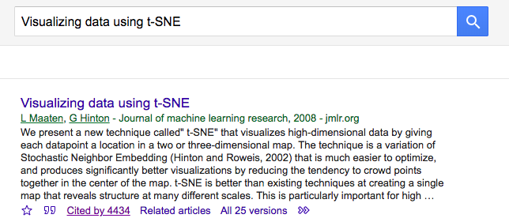

# Google scholar citation keywords

Google scholar 에서 관심있는 논문을 citation 한 논문들의 주제를 요약하기 위한 작업

관심있는 논문을 인용한 논문들의 제목, snippest 등을 스크래핑 한 뒤, 이를 바탕으로 키워드 분석을 수행

## Scripts

### Scrapping

    python scrapper.py --input_file input.txt --sleep 100 --error_sleep 1800 --output_suffix tsne

or default

    python scrapper.py

| arguments | default | description |
| --- | --- | --- |
| input_file | input.txt | Input file. It contains front url and citation numbers |
| sleep | 10 | Sleep time when a page was scrapped. Preventing Google's block |
| error_sleep | 300 | Sleep time when exception occurs |
| output_suffix | '' | Output file suffix. Output file prefix is scrapping start datetime |

### Input file format. 

아래 이미지처럼 찾고 싶은 논문의 citation 을 눌렀을 때 나오는 첫 화면. 아래 화면을 누르면 다음 url 을 얻을 수 있음

    https://scholar.google.co.kr/scholar?cites=14270678001885118036&as_sdt=2005&sciodt=0,5&hl=en

num citations 는 해당 논문이 인용된 횟수

    4434

### Output file format

Tap separated. (title, authors, year, snippest, n_citations)